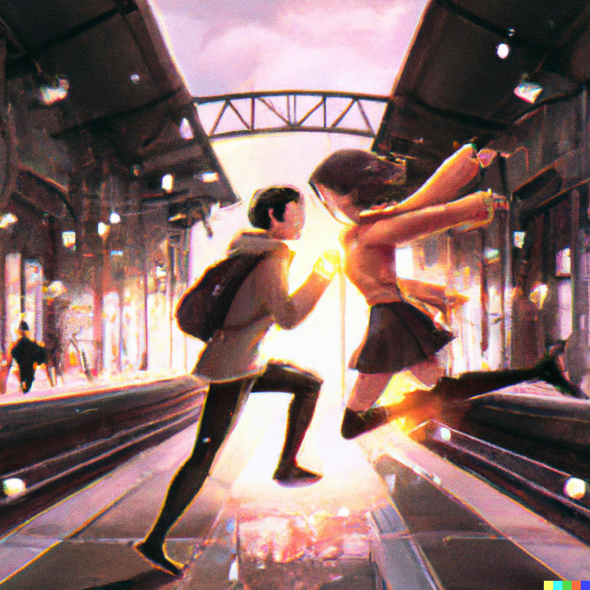
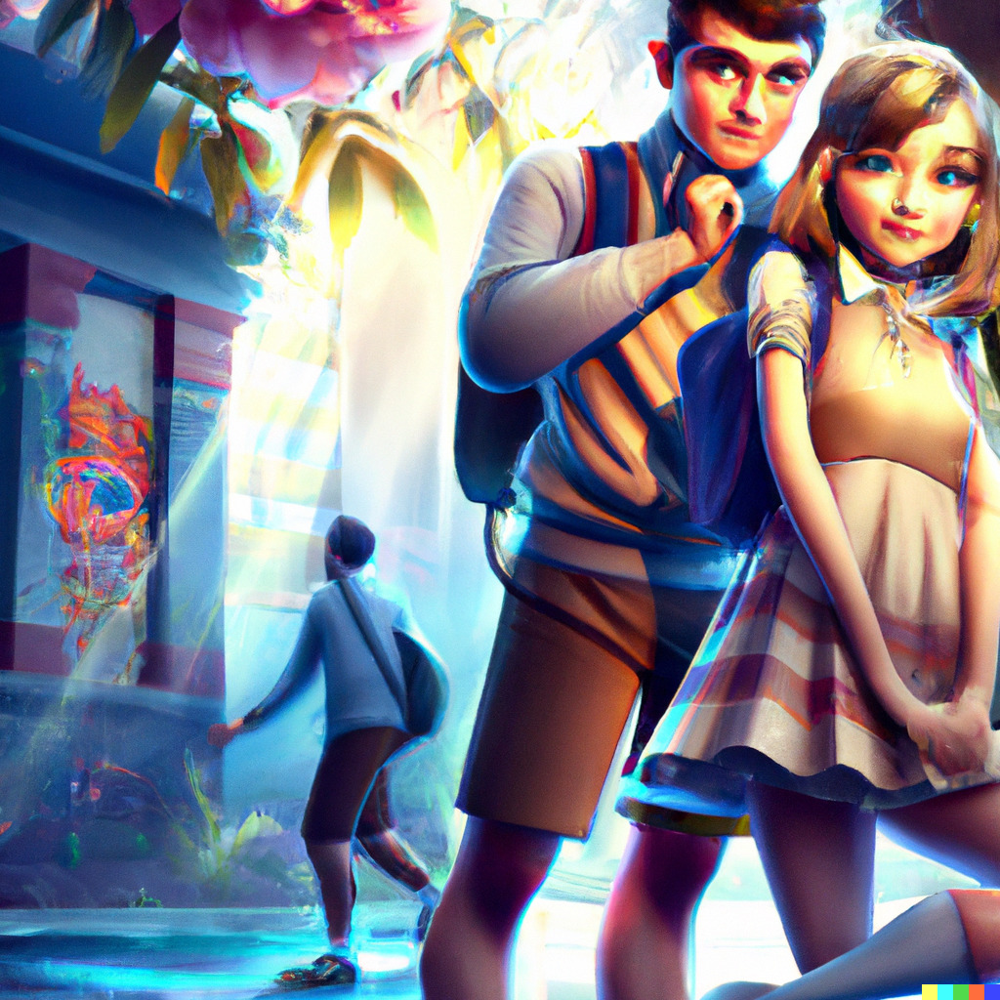
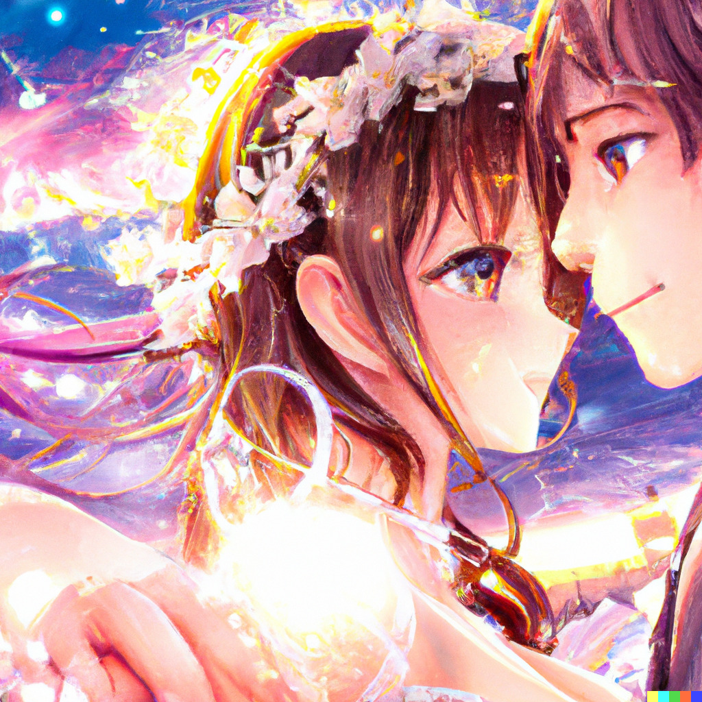

¿Sabías que puedes crear historias de amor increíbles utilizando inteligencia artificial? 🤯 Con herramientas como [ChatGPT](https://chat.openai.com/chat) y [DALL-E](https://labs.openai.com/), puedes escribir y crear imágenes de manera sencilla y rápida. ¡Es súper divertido! 🤩

Aquí tienes un ejemplo de cómo funciona:

- **ChatGPT** es como tener un escritor virtual. Solo tienes que escribir lo que quieres que pase en tu historia y ChatGPT se encargará de rellenar los detalles y hacer que suene natural.
- **DALL-E** es como tener un artista virtual. Solo tienes que escribir una descripción de lo que quieres que se vea en la imagen y DALL-E te creará una ilustración única y creativa.

¡Así de fácil! 🤗

A continuación, te muestro un ejemplo de la historia de amor que creé utilizando estas herramientas:

### El señor adivina 🔮 y la leo 🦁

{: .box-note}
La historia de amor entre "el señor adivina" 🔮 y "la leo" 🦁 comienza en la universidad 🏫, donde ambos estudian ingeniería de sistemas 💻. A pesar de que compartían la misma clase y la misma pasión por la tecnología 💻, "el señor adivina" y "la leo" nunca se habían cruzado antes.
{: .mx-auto.d-block :}

{: .box-note}
Un día, mientras "el señor adivina" trabajaba en un proyecto en el laboratorio de informática 💻, se encontró con "la leo", quien estaba buscando un libro 📚 en una estantería cercana. Al verla, "el señor adivina" sintió una conexión instantánea 😍 y no pudo resistir la tentación de hablar con ella.
{: .mx-auto.d-block :}

{: .box-note}
A medida que conversaban, "el señor adivina" se dio cuenta de que "la leo" era una chica inteligente y divertida 😁, y se sintió atraído por su personalidad alegre 😄 y su pasión por la tecnología 💻. Sin embargo, ambos eran demasiado tímidos 😳 para hablar de sus sentimientos y decidieron seguir siendo amigos.

{: .box-note}
Fue entonces cuando entró en escena "el papu" 🐒, un amigo cercano de "la leo" que siempre había sido muy bueno para emparejar a la gente 💕. Desde el primer momento, "el papu" vio el potencial de una relación entre "el señor adivina" y "la leo" y decidió intervenir para ayudarlos a enamorarse.
{: .mx-auto.d-block :}

{: .box-note}
Con el tiempo, "el papu" organizó citas románticas 👩‍❤️‍💋‍👨 y eventos especiales 🎉 para que "el señor adivina" y "la leo" pudieran estar juntos y conocerse mejor. Finalmente, después de mucho esfuerzo 💪 y gracias a la ayuda de "el papu" 🙏, "el señor adivina" y "la leo" se dieron cuenta de que estaban enamorados ❤️  y decidieron casarse 💒. A pesar de las dificultades que enfrentaron, nunca dejaron de amarse y apoyarse mutuamente 💕. Juntos, lucharon por superar cualquier obstáculo 💪 y vivieron felices para siempre 😊, mientras se graduaban con honores 🎓 y comenzaban sus carreras en el mundo de la tecnología 💻.
{: .mx-auto.d-block :}

¡Espero que hayas disfrutado la historia de amor y esta pequeña guía sobre cómo crear historias de amor con inteligencia artificial! 🤓 Si quieres probar más herramientas como estas, solo tienes que buscarlas en internet. ¡Asegúrate de compartir tu creación con tus amigos! 😊

¡Hasta la próxima! 😉
