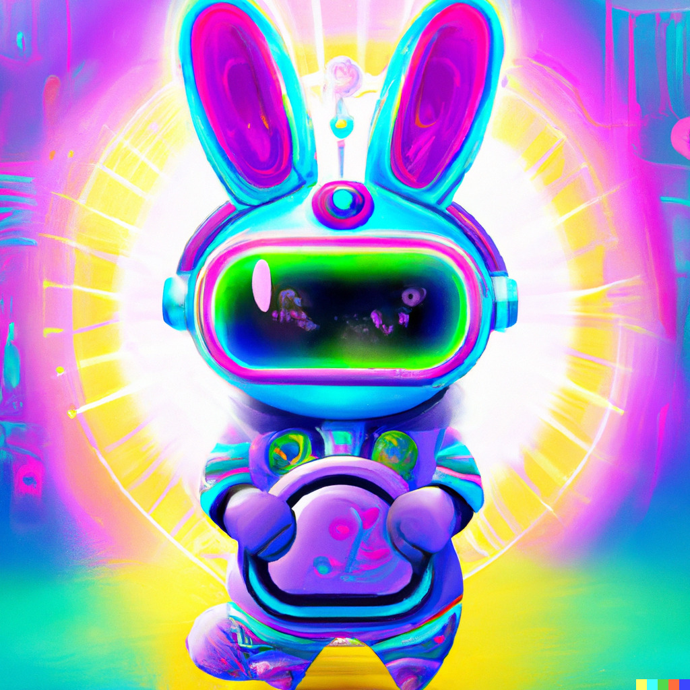

¿Te has preguntado alguna vez cómo serán las compras en el futuro? 🤔 ¿Estarías dispuesto a realizar compras en internet de una manera más dinámica, como ver los productos en 3D? 🛍️ Pues bien, en este post vamos a hablar sobre el futuro que nos espera de cara a unos 10 años. Además, los invitaremos a visitar una Mug Store que hemos construido en realidad aumentada! 🌟

Empecemos hablando del metaverso, para los que no conozcan este término, es un concepto que se utiliza para explicar la creación de un mundo digital que puede ser totalmente aislado de la realidad o puede ayudarnos a complementarla. Es aquí, cuando entran en juego tecnologías como **realidad aumentada**, **realidad virtual** e **inteligencia artificial**. Para que te des una idea de cómo pueden llegar a ser estos mundos virtuales, te dejamos algunos ejemplos de metaversos que podrías visitar: 🚀

{: .mx-auto.d-block :}

### Realidad Virtual
- [Decentraland](https://decentraland.org/): Es un mundo virtual que funciona en la blockchain de Ethereum. Los usuarios pueden crear, poseer e interactuar con contenido y aplicaciones en este mundo virtual.
- [The Sandbox](https://www.sandbox.game/en/): Es un mundo virtual basado en blockchain donde los jugadores pueden crear, poseer y monetizar sus experiencias de juego usando NFTs (monedas no fungibles) y otros componentes de blockchain.
- [Illuvium](https://illuvium.io/): El primer IBG (Interoperable Blockchain Game) del mundo, es un próximo juego de exploración de mundo abierto, coleccionista de criaturas NFT y juego de batallas automáticas creado en la cadena de bloques Ethereum.

### Realidad Aumentada
- [OVER](https://www.overthereality.ai/): Es la infraestructura descentralizada para AR Metaverse, fusionando el mundo físico y virtual a través de la Realidad Aumentada, creando una nueva dimensión donde todo es posible.
- [The Winkyverse](https://www.winkyverse.io/): El primer metaverso de aprendizaje global basado en juegos, es un universo inmersivo y positivo que ofrece un juego significativo y experiencias enriquecedora para todos.

Ahora que ya estás más familiarizado con el concepto de metaverso, te invitamos a que lo explores al máximo. Una manera de hacerlo es visitando nuestra tienda construida en realidad aumentada dentro del metaverso de _OVER_. Te dejamos un video donde explicamos a la perfección cómo puedes ingresar al lugar utilizando sólo tu celular. ¡Fascinante! ¿no lo crees? 🚀🛍️

<blockquote class="tiktok-embed" cite="https://www.tiktok.com/@crear_over/video/7161638291488525574" data-video-id="7161638291488525574" style="max-width: 605px;min-width: 325px;" > <section> <a target="_blank" title="@crear_over" href="https://www.tiktok.com/@crear_over?refer=embed">@crear_over</a> Hoy aprenderemos a como poder visitar nuestra tienda 🏪🙋🏽‍♂️🙋🏽‍♀️, recuerda estás tres palabras panama.mclean.unsolicited <a title="voiceeffects" target="_blank" href="https://www.tiktok.com/tag/voiceeffects?refer=embed">#voiceeffects</a> <a title="metaverse" target="_blank" href="https://www.tiktok.com/tag/metaverse?refer=embed">#metaverse</a> <a title="over" target="_blank" href="https://www.tiktok.com/tag/over?refer=embed">#Over</a> @CreAR <a target="_blank" title="♬ sonido original - CreAR" href="https://www.tiktok.com/music/sonido-original-7161638351819246342?refer=embed">♬ sonido original - CreAR</a> </section> </blockquote> 

Les dejamos un video bonus para que vean cómo se ve la tienda a campo abierto: 📹

<blockquote class="tiktok-embed" cite="https://www.tiktok.com/@crear_over/video/7161957357507890437" data-video-id="7161957357507890437" style="max-width: 605px;min-width: 325px;" > <section> <a target="_blank" title="@crear_over" href="https://www.tiktok.com/@crear_over?refer=embed">@crear_over</a> Los invitamos a que exploren nuestra <a title="tiendavirtual" target="_blank" href="https://www.tiktok.com/tag/tiendavirtual?refer=embed">#tiendavirtual</a>  🏪, dentro de ella encontrarán varias sorpresas, estaremos atentos a cualquier comentario de ustedes 🚀🚀🚀 <a title="realidadaumentada" target="_blank" href="https://www.tiktok.com/tag/realidadaumentada?refer=embed">#realidadaumentada</a> <a title="metaverso" target="_blank" href="https://www.tiktok.com/tag/metaverso?refer=embed">#metaverso</a> @CreAR <a target="_blank" title="♬ Viva La Vida - Coldplay" href="https://www.tiktok.com/music/Viva-La-Vida-6711209819333724162?refer=embed">♬ Viva La Vida - Coldplay</a> </section> </blockquote> 

Esperamos que en un futuro, toda esta tecnología esté más cercana a todo tipo de personas y se convierta en algo tan común como si se tratase de navegar por internet. Los invitamos a que nos sigan en nuestras distintas redes sociales para que nos comenten qué tal les parece este tipo de contenido y puedan seguir aprendiendo sobre _realidad mixta_ e _inteligencia artificial_. ¡Hasta una próxima oportunidad! 🤖🌟
